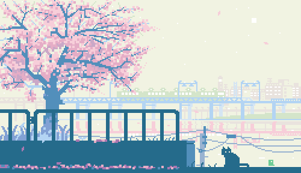

  

  
   

<h3>Hey there, I’m Franklin (he/him) 👋</h3>

## 🌱 Background

I am a 5th-year Cognitive Systems student at UBC. I've worked previously at the [UBC Cloud Innovation Centre](https://cic.ubc.ca/), [Sparkle AI](https://www.sparkleai.co.jp/ja/about), and most recently the [Human-AI Interaction Lab @ UBC](https://hai.cs.ubc.ca/). I am part of the Applied AI Subteam of [UBC Agrobot](https://engineering.ubc.ca/engineering-design-teams/agrobot), and have done some freelance Web Dev through the Riipen program. I also completed a 1-year exchange at the University of Tokyo.

In terms of non-technical roles, I have TA'd for programming and Japanese, both beginner (CPSC110, JAPN100) and intermediate (CPSC210, JAPN200), at UBC. During my time in Japan, I was an English Conversation Tutor for children aged 5-12.

## 🌃 Interests

I am interested in the intersection of computer science and linguistics, and wish to explore how linguistic theory can be applied to create meaningful language technologies. I am particularly keen towards formal semantics.

In my free time, I enjoy learning languages and engaging in intercultural communications. I am fluent in Japanese, proficient in Mandarin, and can still read some French.

## 📌 Pinned

| [Devpost](https://devpost.com/terwo) |
| ------------------------------------------------------------------------------------------------------------------------------------------- |

<!--
**terwo/terwo** is a ✨ _special_ ✨ repository because its `README.md` (this file) appears on your GitHub profile.

Here are some ideas to get you started:

- 🔭 I’m currently working on ...
- 🌱 I’m currently learning ...
- 👯 I’m looking to collaborate on ...
- 🤔 I’m looking for help with ...
- 💬 Ask me about ...
- 📫 How to reach me: ...
- 😄 Pronouns: ...
- ⚡ Fun fact: ...
-->
